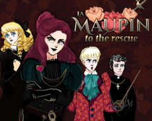

+++
title = "Games"
date = 2017-09-25T23:26:49-03:00
weight = 6
chapter = true
pre = "<b>6. </b>"
+++

# Games made with RenJS

### Add yours: send me a link to lunafromthemoon@renjs.com

## The Tutorial

RenJS tutorial, learn how to make a game easily with RenJS.

Created by lunafromthemoon.

## La Maupin to the Rescue!

Rescue your beloved girlfriend from the evil convent. Fight drunks, sneak around, fool people, set things on fire!

Created by rumpel.